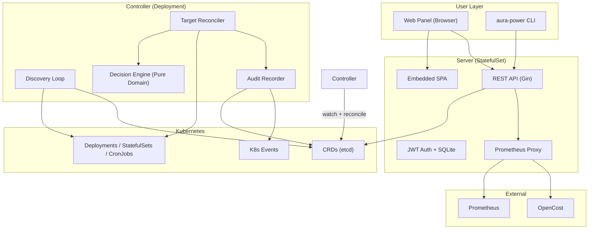
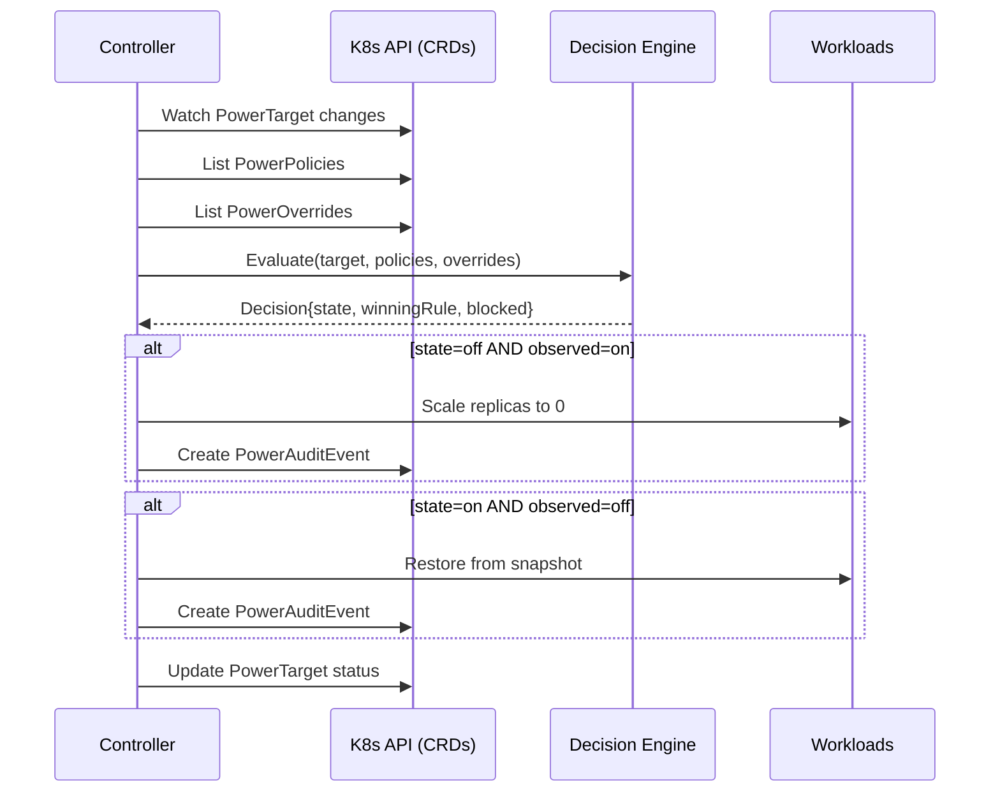
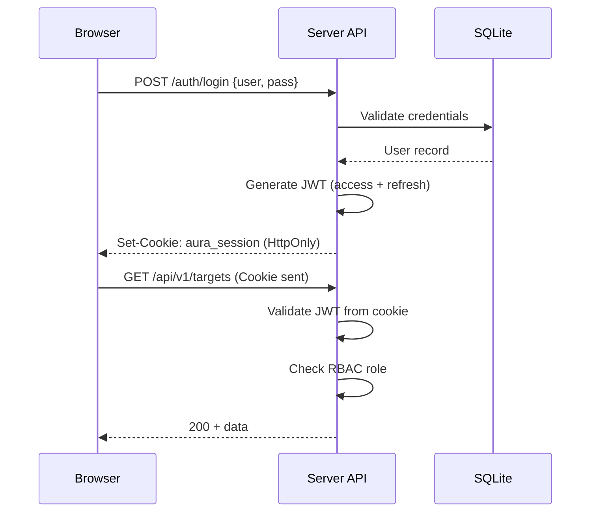

# Architecture

Aura Power follows a split architecture with two independently deployable components communicating through Kubernetes CRDs.

## Components



## Data Flow

### Reconciliation Cycle (every 30s)



### Authentication Flow



## CRD Lifecycle

| CRD | Created By | Updated By | Read By |
|-----|-----------|------------|---------|
| PowerTarget | Controller (discovery) | Controller (reconciler) | Server API |
| PowerPolicy | Server API / kubectl | Server API / kubectl | Controller |
| PowerOverride | Server API / kubectl | Controller (phase=Expired) | Controller |
| PowerAuditEvent | Controller | — | Server API |
| PowerSchedule | Server API / kubectl | — | Controller |
| PowerNamespaceGroup | Server API / kubectl | — | Controller |

## Security Model

- **Server RBAC**: Read/write to Aura Power CRDs only. Read workload metadata.
- **Controller RBAC**: Read/write CRDs. Patch workloads (scale). Create Events.
- **User RBAC**: Three roles (member/approver/admin) enforced at API layer via JWT claims.
- **No cluster-admin required**: Both components use least-privilege ServiceAccounts.

## Deployment Topology

```
Namespace: aura-system
├── StatefulSet/aura-power-server (1 replica)
│   ├── PVC: SQLite (auth + audit metadata)
│   ├── Port 8080: API + Panel
│   └── Serves: /healthz, /readyz, /metrics
├── Deployment/aura-power-controller (1 replica, leader election)
│   ├── Stateless (all state in CRDs)
│   ├── Port 8081: health probes
│   └── Reconciles: PowerTargets, PowerPolicies, PowerOverrides
└── CRDs: 6 custom resources in power.aura.sh/v1alpha1
```

## Decision Engine (Pure Domain)

The decision engine is a pure function with no I/O dependencies:

```
Input:  Target + []Policies + []Overrides + time.Now()
Output: Decision{DesiredState, WinningRule, SuppressedRules, Blocked, BlockReasons}
```

Rules:
1. Filter policies/overrides that match the target's scope
2. Evaluate time windows against current time
3. Sort by priority (descending)
4. Highest priority wins
5. If tied priority: Override > Policy > "on" (safety-first)
6. Check guardrails (system namespace, ArgoCD, Flux, HPA, Helm)
7. If blocked: set Blocked=true with reasons
